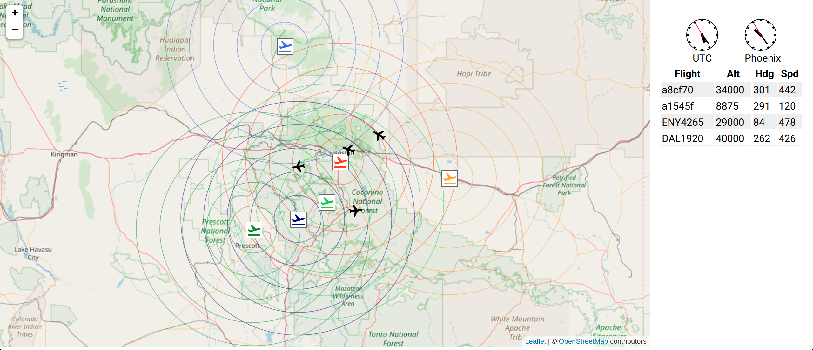

# dump1090-client
This is yet-another-take on a UI for the dump1090 program. dump1090 interfaces with a software
defined radio (SDR) to monitor the status transmissions of aircraft.

The app is built with:

- React
- Leafletjs
- OpenStreetMap
- Various goodness from npm.

## Features

- The center of the map is calculated from the initial fetch of data.json from the dump1090 daemon. The lat/lon of the aircraft are averaged and the map center set to the result.
- Each displayed airport has a color-coded set of range rings. The range increases 10 nmi per ring.
- The airports are ordered by their distance from the lat/lon average and the first 6 are displayed.
- Hovering an aircraft icon reveals the callsign or IACO hex identifier of the aircraft.
- Clicking an aircraft or airport icon pops up information about the item.

## Demo

The demo folder contains dockerfiles to build the three services and a docker-compose-yml to tie it all together. Execute `docker-compose up` in the `./demo` directory and then point your browser to `http://localhost:80`.

The three services used by the demo are:

- dump1090
- data
- app

### dump1090

This container runs the dump1090 daemon and exposes ports to the networks (internal and external). To view the data being sent to the UI browse `http://localhost:8080/data.json`.

You can use netcat to view the raw and decoded data stream. On a Linux box run `nc localhost 30002` for the raw data and `nc localhost 30003` for the decoded data.

### data

The file `raw.dat` contains about an hours worth of raw data recorded in Flagstaff, AZ in late January, 2020. The data is sent to the dump1090 service over port 30001 at the rate of 10 messages/s.

### app

This container builds the react app and serves it over port 80.