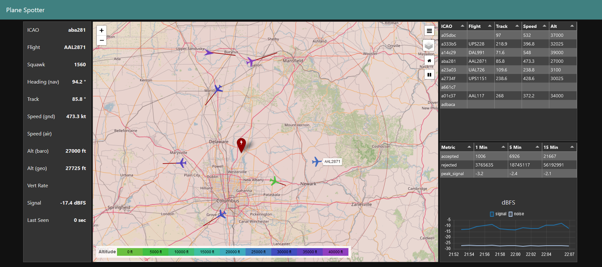

# Plane Spotter

An ADS-B airplane tracker.



### Usage

Edit the ```default.env``` file to show the lat/lon of the station and the serial number of the SDR
dongle. If you only have one dongle then set the DEVICE_SN=0.

To build the images and launch the containers, run ```docker compose up -d```.

Then point your browser to ```http://localhost:1880/ui/```.
